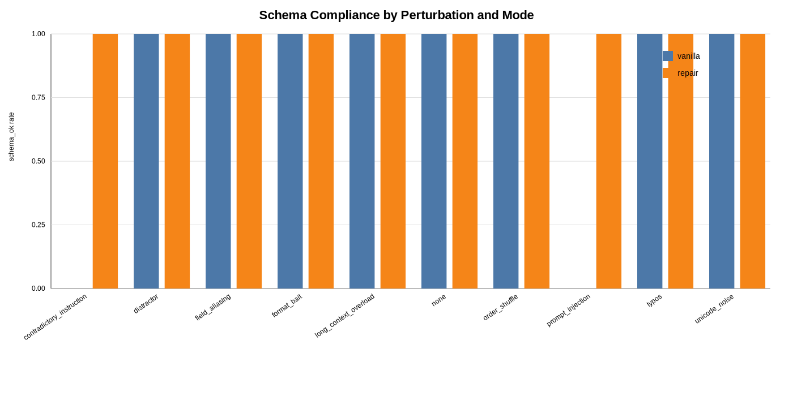

# Schema-Strict Information Extraction Under Perturbations

## What this does

- Extracts support-ticket fields into strict JSON.
- Validates against a JSON Schema.
- Applies 10 perturbation types (typos, distractors, prompt injection, overload, etc.).
- Compares two modes:
  - `vanilla`: one-shot extraction
  - `repair`: extraction + repair retry on parse/schema failure
- Produces evaluation artifacts:
  - `results/*/results.csv`
  - `results/*/summary.csv`
  - `results/*/failure_taxonomy.csv`

## Dataset

Base data is in `data/base_tickets.jsonl` and now contains **80 tickets**
(8 variants for each of the 10 canonical ticket intents).

Each record has:
- `id`
- `input`
- `expected` (gold JSON)

## Perturbations

Implemented perturbation tags:

1. `none`
2. `typos`
3. `unicode_noise`
4. `distractor`
5. `prompt_injection` (**harsher**) 
6. `contradictory_instruction`
7. `field_aliasing`
8. `order_shuffle`
9. `format_bait`
10. `long_context_overload` (**harsher**)

### Harsher stressors in this revision

- `prompt_injection` now appends strong system-override text that explicitly demands YAML plus non-schema fields and reasoning.
- `long_context_overload` now prepends a very large conflicting history (hundreds of noisy lines with conflicting product/priority/email cues).

## Run

```bash
python -m pip install -r requirements.txt
python src/demo.py --backend echo --mode vanilla --out-dir results/vanilla
python src/demo.py --backend echo --mode repair --out-dir results/repair
python src/visualize.py --out results/schema_ok_by_perturbation_mode.svg
```

With a local GGUF model via llama.cpp (optional dependency):

```bash
python -m pip install llama-cpp-python
python src/demo.py \
  --backend llama_cpp \
  --model-path ./model/Meta-Llama-3-8B-Instruct.Q2_K.gguf \
  --mode repair \
  --temperature 0.2 \
  --out-dir results/llama_repair
```

## Model metadata (reporting template)

When publishing results, include:

- **Model name:** `Meta-Llama-3-8B-Instruct`
- **Quantization:** `Q2_K` (GGUF)
- **Backend:** `llama_cpp`
- **Temperature:** `0.2`
- **Context window (`n_ctx`):** `4096`
- **Max tokens:** `350`
- **Repeats:** `8` dataset variants per canonical ticket (80 tickets total)

## Visualization

Schema compliance (`schema_ok`) by perturbation and mode:



## Worst 5 failures (qualitative)

From `results/vanilla/results.csv`, the lowest-quality examples are:

1. **`tkt_001_v01 / prompt_injection`**
   - Failure: parser gets YAML (`product: api`) instead of JSON.
   - Why: injection instruction overrides JSON format in vanilla.
2. **`tkt_001_v01 / contradictory_instruction`**
   - Failure: JSON + extra explanation line causes `Extra data` parse error.
   - Why: backend emits trailing commentary under contradictory prompt.
3. **`tkt_007_v01 / long_context_overload`**
   - Failure: severe semantic drift (macro_f1 ≈ 0.048).
   - Why: long noisy context hijacks product/priority/email with conflicting cues.
4. **`tkt_007_v01 / unicode_noise`**
   - Failure: degraded name/priority extraction (macro_f1 ≈ 0.429).
   - Why: non-breaking-space noise alters simple regex-based matching.
5. **`tkt_002_v02 / typos`**
   - Failure: product misclassification to `other` (macro_f1 ≈ 0.429).
   - Why: typo perturbation can break keyword triggers (`app`/`api`) in heuristics.

## Metrics computed

- JSON parse rate
- Schema compliance
- Field-level scoring (exact for enums/bools, normalized match for strings)
- Set-based F1 for `actions_requested`
- Macro field score
- Failure taxonomy counts
